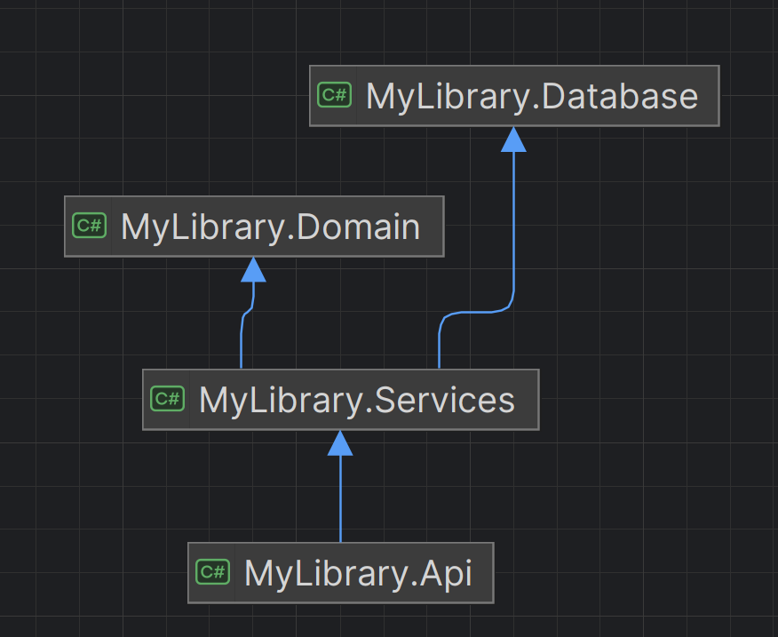

## Library Manager Api
Simple monolith web application <br>
.NET 8, EF Core, PostgreSQL <br>

<br><br>

# Getting started
Run in this directory to build and run app
```bash
docker build -t mylibrary-api .
```

```bash
docker run -d -p 8080:8080 \
  --name mylibrary-container \
  -e "ASPNETCORE_ENVIRONMENT=Development" \
  -e "ConnectionStrings__DefaultConnection=YOUR_CONNECTION_STRING" \
  mylibrary-api
```
<br>
After that, Swagger will be available at: http://localhost:8080/swagger
